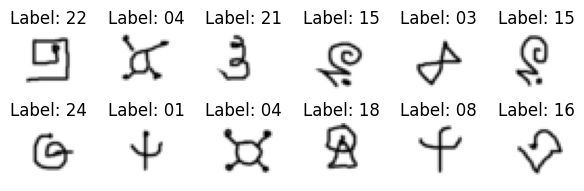

This implementation is inspired by [**"Model-Agnostic Meta-Learning for Fast Adaptation of Deep Networks"**](https://arxiv.org/abs/1703.05175) (2017) by Jake Snell, Kevin Swersky, Richard S. Zemel.
* **Note & Reference:** [GitBook](https://lif31up.gitbook.io/lif31up/few-shot-learning/model-agnostic-meta-learning-for-fast-adaptation-of-deep-networks)
* **⭐ Colab Playground:** [Colab](https://colab.research.google.com/drive/1ZmtP8rMZsSN_yA6tz3IKQU0ECXeAI018?usp=sharing)
* **Huggingface:** [Huggingface](https://huggingface.co/lif31up/model-agnostic-meta-learning)

**Implementations:**
* `CNN_MAML`: Convolutional Network with MAML
* `CNN_BOIL`: Convolutional Network with BOIL
* `ResNet_MAML`: Residual Network with MAML
* `ResNet_BOIL`: Residual Network with BOIL

|           5w5s ACC                  | CNN_MAML       | CNN_BOIL       | ResNet_MAML    | ResNet_BOIL   |
|-----------------------------|----------------|----------------|----------------|---------------|
| `Omniglot Futurama`  | `86% (86/100)` | `83% (83/100)` | `86% (86/100)` | `90%(90/100)` |

## Model-Agnostic Meta-Learning for Few-Shot Image Classification
The main purpose was to implement the from-scratch Model-Agnostic Meta-Learning (MAML) algorithm that's easy to execute on educational cloud environments.


<section style="width: max-content; height: fit-content; display:flex; justify-content: center; align-content: center;">
  
</section>

* **Task**: classifying image with few dataset.
* **Dataset**: `omniglot futurama`

FSL(Few-Shot Learning) focuses on enabling models to generalize to new tasks with only a few labeled examples. 
MAML achieves this by optimizing for a set of parameters that can quickly adapt to new tasks through gradient-based updates, allowing the model to efficiently learn from limited data.

---
### Configuration
confing.py contains the configuration settings for the model, including the framework, dimensions, learning rate, and other hyperparameters

```python
class Config:
  def __init__(self):
    self.input_channels, self.hidden_channels, self.output_channels = 1, 32, 5
    self.n_convs = 4
    self.kernel_size, self.padding, self.stride, self.bias = 3, 1, 1, True
    self.iterations, self.alpha = 100, 1e-3
    self.eps = 1e-5
    self.epochs, self.beta = 30, 1e-4
    self.batch_size = 8
    self.n_way, self.k_shot, self.n_query = 5, 5, 5
    self.save_to = "./models"
    self.transform = transform
    self.imageset = get_imageset()
```
### Training
train.py is a script to train the model on the omniglot dataset. It includes the training loop, evaluation, and saving the model checkpoints.
```python
if __name__ == "__main__":
  from config import Config
  device = torch.device("cuda" if torch.cuda.is_available() else "cpu")
  maml_config = Config()
  imageset = maml_config.imageset
  seen_classes = [_ for _ in random.sample(list(imageset.class_to_idx.values()), maml_config.n_way)]
  episoder = FewShotEpisoder(imageset, seen_classes, maml_config.k_shot, maml_config.n_query, maml_config.transform)
  model = ResNetMAML(maml_config)
  train(path=maml_config.save_to, model=model, config=maml_config, episoder=episoder, device=device)
```
### Evaluation
eval.py is used to evaluate the trained model on the omniglot dataset. It loads the model and tokenizer, processes the dataset, and computes the accuracy of the model.
```python
if __name__ == "__main__":
  from config import Config
  device = torch.device("cuda" if torch.cuda.is_available() else "cpu")
  my_data = torch.load("put your model path!!", map_location=device, weights_only=False)
  config, convig = my_data['config'], Config()
  my_model = ResNetMAML(config).to(device)
  my_model.load_state_dict(my_data["sate"])
  unseen_classes = [_ for _ in random.sample(list(convig.imageset.class_to_idx.values()), my_data["FRAMEWORK"]["n_way"])]
  evisoder = FewShotEpisoder(convig.imageset, unseen_classes, convig.k_shot, convig.n_query, config.transform, True)
  counts, n_problems = evaluate(my_model, evisoder=evisoder, config=config, device=device, logging=True)
  print(f"unseen classes: {evisoder.classes}\nACC: {(counts / n_problems):.2f}({counts}/{n_problems})")
```
---
## Technical Highlights
Although MAML is one of the most prominent few-shot learning algorithms, it's mathematically complex even compared to other modern deep learning approaches. Both the learning and evaluation processes consist of two stages.

### Inner Loop
The inner loop is the first stage of MAML's algorithm where task-specific adaptations occur. It involves taking a small number of examples (support set) from a new task and creating parameters for each task. It then performs gradient updates to quickly adapt the model parameters for that specific task.

```python
class ResNetMAML(nn.Module):
  def inner_update(self, task, device=None):
    local_param = {name: param.clone() for name, param in self.named_parameters()}  # init local params
    for _ in range(self.config.iterations): # update local params to the task
      for feature, label in DataLoader(task, batch_size=self.config.batch_size, shuffle=True, pin_memory=True, num_workers=4):
        feature, label = feature.to(device, non_blocking=True), label.to(device, non_blocking=True)
        pred = self.forward(feature, local_param)
        loss = nn.MSELoss()(pred, label)
        grads = torch.autograd.grad(loss, list(local_param.values()), create_graph=True)
        local_param = {name: param - (self.config.alpha * grad) for (name, param), grad in zip(local_param.items(), grads)}
    return local_param
  # inner_update()
```
### Outer Loop
The outer-loop is the second stage of MAML's algorithm where meta-learning occurs. It optimizes the initial model parameters to ensure they can be quickly adapted to new tasks with minimal data. This stage uses performance on the query set to update the model's starting point.

```python
def train(model, path, config, episoder:FewShotEpisoder, device):
  assert isinstance(config, Config), "config is not a Config."

  model.to(device)
  optim = torch.optim.Adam(model.parameters(), lr=config.beta, eps=config.eps)
  criterion = nn.CrossEntropyLoss()

  progression = tqdm(range(config.epochs))
  for _ in progression:
    tasks, query_set = episoder.get_episode()
    local_params = list()
    for task in tasks: local_params.append(model.inner_update(task=task, device=device)) # inner loop: init local params, adapt to the task, ueses seen classes in support_set
    loss = float(0)
    for feature, label in DataLoader(query_set, batch_size=config.batch_size, shuffle=True, pin_memory=True, num_workers=4):
      feature, label = feature.to(device, non_blocking=True), label.to(device, non_blocking=True)
      task_loss = float(0)
      for local_param in local_params:
        pred = model.forward(feature, local_param)
        task_loss += criterion(pred, label)
      loss += task_loss / len(local_params) # calculate avg of losses per tasks
    loss /= query_set.__len__()
    optim.zero_grad()
    loss.backward()
    optim.step()
    progression.set_postfix(loss=loss.item())

  features = {
    "sate": model.state_dict(),
    "config": config
  } # feature
  torch.save(features, f"{path}.bin")
```

### Forward
The forward process in MAML differs significantly from other deep neural networks. First, it adapts to tasks from the query set. Then, it forwards each parameter per task and calculates probabilities.

```python
class ResNetMAML(nn.Module):
  def forward(self, x, params=None):
    x = F.conv2d(
      input=x,
      weight=params[f'convs.{0}.weight'],
      bias=params[f'convs.{0}.bias'],
      stride=self.config.stride,
      padding=self.config.padding
    ) # first conv
    for i in range(1, self.convs.__len__()):
      res = x
      x = F.conv2d(
        input=x,
        weight=params[f'convs.{i}.weight'],
        bias=params[f'convs.{i}.bias'],
        stride=self.config.stride,
        padding=self.config.padding,
      ) # hidden convs
      x = self.act(x)
      x += res
    x = self.pool(x)
    x = self.flat(x)
    return F.linear(x, weight=params['fc.weight'], bias=params['fc.bias'])
```